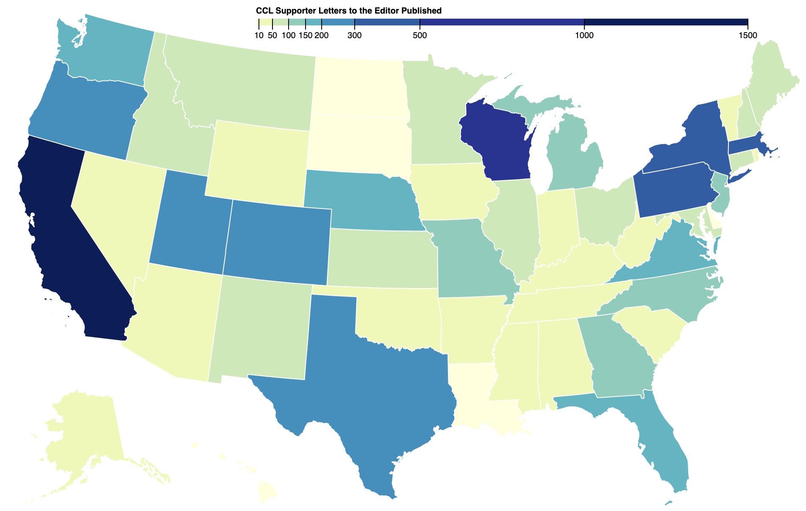
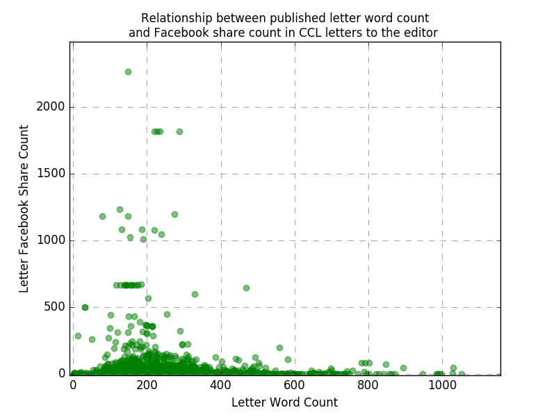
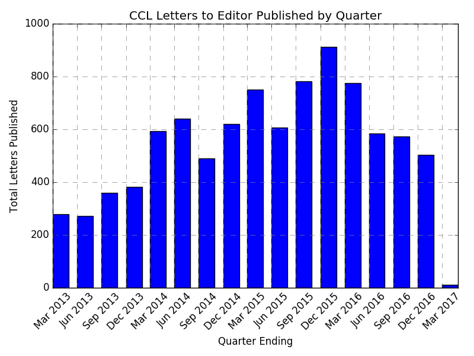

# Citizens' Climate Lobby Letter Engagement Analysis

An analysis of Facebook share volume for Citizens' Climate Lobby (CCL) letters to the editor, examining associations between letter characteristics, state political context, and social media engagement.

## Project Overview

This project analyzes the factors that influence Facebook sharing of CCL letters to the editor published in news media. By merging organizational datasets of published letters with Facebook API share counts and congressional representation data from ProPublica, the analysis identifies which letter characteristics and contextual factors are associated with higher social media engagement.

## Key Findings

The regression analysis revealed several significant associations with Facebook share counts:

**Significant Factors:**
- **Letter length**: More concise letters (300 words and under) were associated with higher share counts
- **Recency**: More recent letters at the time of publication were more likely to be shared
- **Sentiment**: Letters with more positive sentiment terms were associated with lower share counts

**Non-significant Factors:**
- State share of Republican representation in Congress
- Use of specific terminology ("fee" vs "tax")

## Data Sources

The project integrates three primary data sources:

1. **CCL Letter Database**: Organizational dataset of letters to the editor submitted and published by CCL supporters
2. **Facebook API**: Share count data extracted for each published letter
3. **ProPublica Congress API**: Congressional representation data by state to assess political context

## Visualizations

### Letters by State

An interactive D3.js visualization shows the geographic distribution of CCL letters published across the United States:



*Interactive version available in `index.html`*

### Analysis Plots



*Relationship between letter word count and Facebook share count*



*Timeline of letter publications*

## Project Structure

```
.
├── index.html                      # Interactive D3 US map visualization
├── train_data.py                   # Main regression analysis script
├── process_text.py                 # Text processing and feature extraction
├── build_letters_by_state_data.py  # Aggregates letter counts by state
├── state_party_count.py            # Congressional representation data processing
├── plot_timeline.py                # Timeline visualization
└── plots/                          # Generated analysis plots
    ├── words_vs_share.png
    └── letter_timeline.png
```

## Methodology

### Data Processing

1. **Data Cleaning** (`process_text.py`): Extract and process letter text, filter for valid US state data and non-null share counts
2. **Feature Engineering**: Generate features including word count, sentiment scores (positive/negative using VADER), keyword presence (fee, tax, dividend), and temporal variables
3. **Congressional Data Integration** (`state_party_count.py`): Merge ProPublica congressional representation data by state

### Statistical Analysis

The analysis employs Generalized Least Squares (GLS) regression with the following model specifications:

**Dependent Variable:** Facebook share count

**Independent Variables:**
- Letter word count (with quadratic term to capture non-linear effects)
- Positive sentiment score
- Negative sentiment score
- Days since first published CCL letter
- State share of Republican congressional representation
- Keyword indicators (tax, fee, dividend)
- Interaction term: Republican share × days since first letter

**Data Filtering:**
- Removed outliers (top 2 most-shared articles including LA Times piece with 47k shares)
- Excluded letters with formatting issues (top 3 by word count)
- Analyzed multiple segments: full dataset, recent letters (2013+), and Republican-dominated states

## Dependencies

```python
- pandas
- numpy
- statsmodels
- scikit-learn
- sqlalchemy
- psycopg2
- nltk (with VADER sentiment analyzer)
- matplotlib
```

## Usage

The analysis pipeline connects to a PostgreSQL database:

```python
python train_data.py
```

Note: Requires a PostgreSQL database named `ccl_lte` with the `LTE_FINAL` table containing merged letter and share count data.

## Interactive Map

To view the interactive state-by-state letter distribution map:

```bash
# Open index.html in a web browser
open index.html
```

The map displays the number of CCL letters published in each state with an interactive color scale. Hover over states to see exact counts.

## Future Directions

Potential extensions of this analysis could include:
- Analysis of letter content themes and their association with engagement
- Time series analysis of sharing patterns
- Examination of news outlet characteristics (circulation, political lean)
- Comparison with other social media platforms beyond Facebook

## License

MIT License

## Acknowledgments

- Citizens' Climate Lobby for providing letter publication data
- ProPublica Congress API for congressional representation data
- Facebook Graph API for share count data
